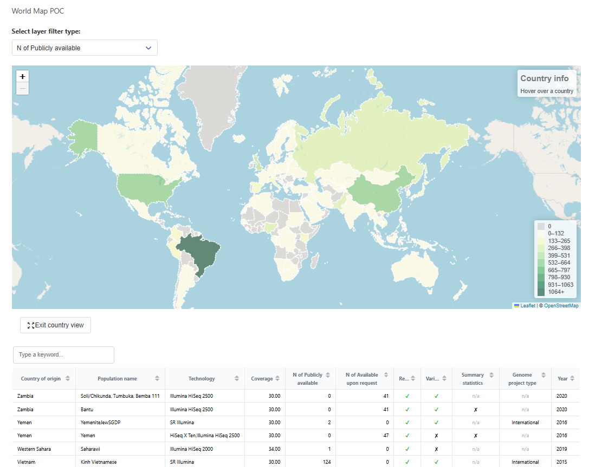
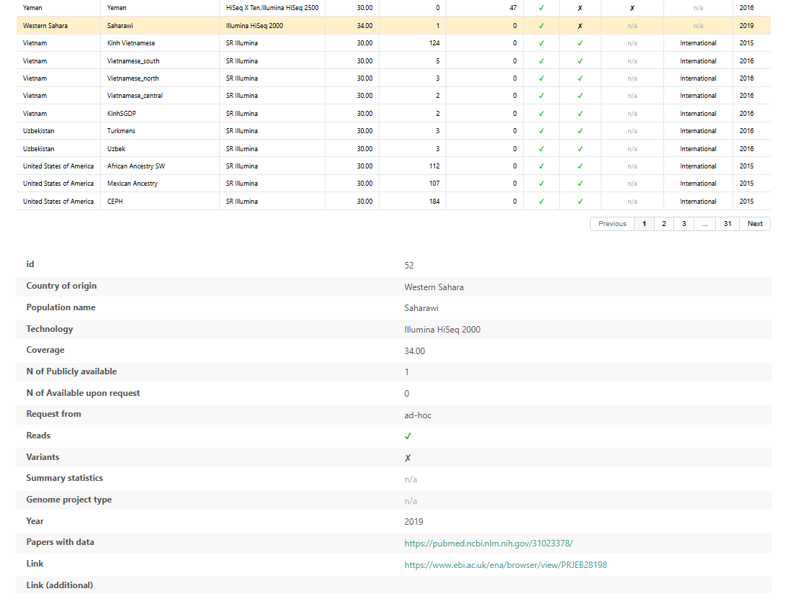
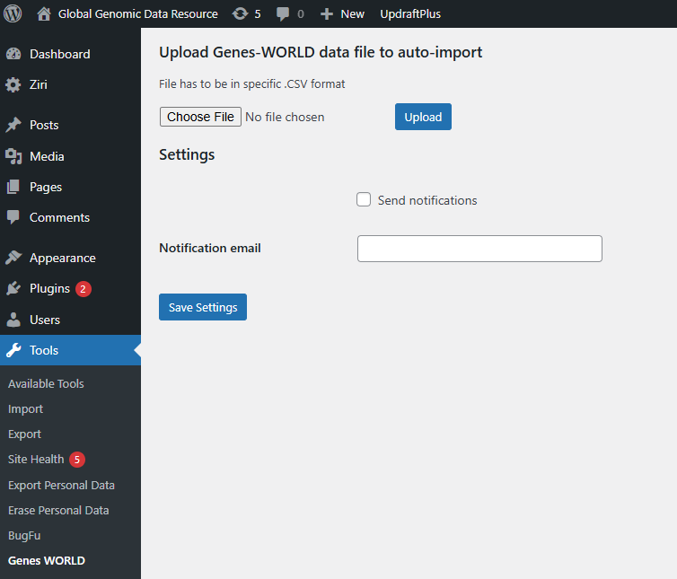

# Genes-WORLD Plugin

**Contributors:** Alex Dubiv  
**Tags:** genome, sequencing, data, table, statistics  
**Requires at least:** 6.0.1  
**Tested up to:** 6.5  
**Stable tag:** 6.5  
**License:** GPLv2 or later  
**License URI:** [http://www.gnu.org/licenses/gpl-2.0.html](http://www.gnu.org/licenses/gpl-2.0.html)

WordPress plugin "Genes-WORLD" provides an intuitive and user-friendly interface for researchers to explore, filter, and contribute to a global collection of genomic data.

## Description

Genes-WORLD operates with two core visualization components: an interactive world map and a tabular data viewer.

- 🌍 **Interactive World Map**: This is the primary tool for exploring genomic data geographically. Users can filter by sample availability, genome project types, and more.

- 📊 **Tabular Data Viewer**: Located beneath the map, this table allows sorting, filtering, and pagination. Clicking a row reveals detailed metadata like country of origin, sequencing tech, data access type, and project links.

Additional details and live accces: https://globgen.uzhnu.edu.ua/ (https://globgen.uzhnu.edu.ua/world-geo-data/)

## Installation

1. Upload the `genes-world-plugin` directory to the `/wp-content/plugins/` directory.
2. Activate the plugin through the 'Plugins' menu in WordPress.
3. In the WP admin panel, go to `Tools -> Genes WORLD` and upload a prepared .CSV file.
4. Create a page and insert the shortcode `[genes_world_geodata]` to display the interactive map and data table.

## Screenshots

### 1. Front-end: Map view

### 2. Front-end: Data table view

### 3. Admin configuration panel

## Changelog

### 1.0
- Initial commit and plugin publication